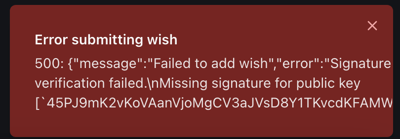

# Wall of Wish

A decentralized wishing wall built on the Solana blockchain where users can post wishes and make donations.



The application combines Web2 and Web3 technologies, using both blockchain storage for immutability and a traditional database for faster queries.

## Features

- Connect Phantom wallet for Solana transactions
- Submit wishes that get stored on the Solana blockchain
- View wishes in real-time through WebSocket connections
- Make crypto donations to specific wishes
- Dark mode UI with modern Shadcn components
- Live updates for new wishes and donations

## Tech Stack

### Frontend
- React with TypeScript
- TailwindCSS for styling
- Shadcn UI components
- WebSocket client for real-time updates
- Phantom Wallet integration

### Backend
- Express.js server
- WebSocket server for live updates
- PostgreSQL with Drizzle ORM
- Solana blockchain integration

### Blockchain
- Solana smart contract (written in Rust)
- Anchor framework for contract development
- Phantom Wallet integration

## Project Structure

```
├── client/          # React frontend application
├── server/          # Express backend server
│   ├── program/     # Solana program (smart contract)
│   └── ...         # Server configuration files
├── shared/          # Shared types and schemas
└── ...             # Configuration files
```

## Getting Started

1. Make sure you have [Node.js](https://nodejs.org/) installed
2. Install dependencies:
   ```bash
   npm install
   ```
3. Set up required environment variables in the Secrets tab:
   - `DATABASE_URL`: PostgreSQL database connection string
   - `SOLANA_NETWORK`: Solana network (devnet/mainnet)

4. Start the development server:
   ```bash
   npm run dev
   ```
   The application will be available at port 5000.

## Development Commands

```bash
# Start development server
npm run dev

# Build for production
npm run build

# Start production server
npm run start

# Type checking
npm run check

# Database schema push
npm run db:push
```

## Features in Detail

### Wish Submission
- Users can connect their Phantom wallet
- Submit wishes that get stored on both blockchain and database
- Real-time updates when new wishes are added

### Donations
- Make crypto donations to specific wishes
- Automatic transaction verification
- Real-time donation tracking

### Real-time Updates
- WebSocket integration for live wish updates
- Transaction status monitoring
- Network status indicators

## UI Components

The project uses Shadcn UI components for a modern, dark-themed interface:
- Custom modals for donation flows
- Transaction info displays
- Network status indicators
- Responsive tables for wish display
- Toast notifications for user feedback

## Database Schema

The application uses a PostgreSQL database with the following main tables:
- Users: Stores user information and wallet addresses
- Wishes: Stores wish details and blockchain references
- Donations: Tracks crypto donations and their status

## Smart Contract

The Solana program (smart contract) handles:
- Wish creation and storage on-chain
- Donation transaction verification
- Public key derivation for wishes

## Production Deployment

The application is configured to run on port 5000 for both development and production environments. The server handles both the API and client serving.

## Live Updates

The application implements WebSocket connections for real-time features:
- Instant wish updates
- Live donation tracking
- Network status monitoring
- Transaction confirmations
# wishchain
